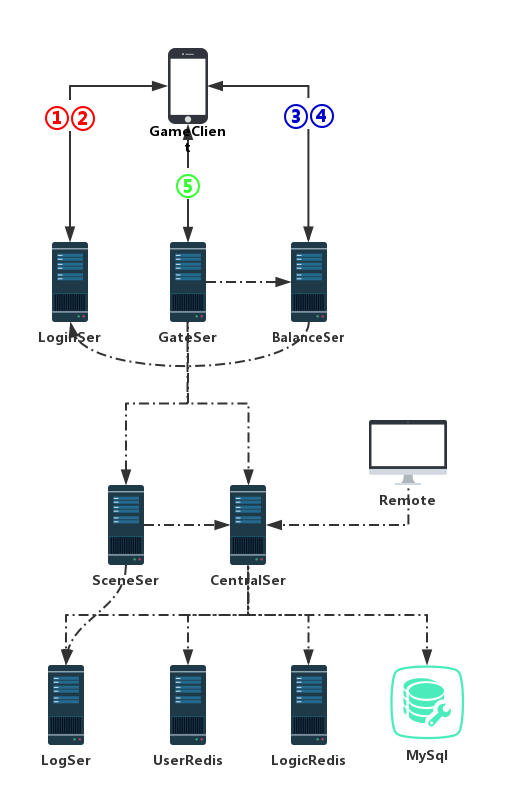

# Introduction

---

- C#reference：https://github.com/niuniuzhu/Final-fight-csharp

**TheLastBattle** is a MOBA game server, like `Arena of Valor`.

Below is the structure of this project：



### Client

[Client](./Client) source files include a standalone project.

-------
### Database

Using SQL sentence below to solve `Authentication plugin 'caching_sha2_password' cannot be loaded` issue:

```sql
ALTER USER root@localhost IDENTIFIED WITH mysql_native_password BY '123321';
```

### Ports used

* CSBattleMgr

  Listen Port | Server
  ------------: | ------------- 
  10010 | RC scene
  10001 | SS scene
  10002 | GS gateway
   1234 | LogMgr
   6379 | redis
   6380 | LogicRedis
  
* LogMgr

  Listen Port | Server
  ------------: | ------------- 
  1234 | Database[*FBAll_LogDB_1*]

